<a href="index.html">Back to Index</a><br/><br/>
We welcome pull requests to the IIIF Guides repository but please read the following guidance. 

## Summary
All pull requests submitted to this repo will need to be checked using the IIIF preview infrastructure which is generated for pull requests. This means the branch you are working on will need to be in the IIIF repo. To allow you to create a branch in the IIIF repo you will need to be in the [guides](https://github.com/orgs/IIIF/teams/guides) GitHub Team. To do this contact one of the members of IIIF staff who can add you.

The stages to add a submission are as follows:

 1. Apply to join the [guides](https://github.com/orgs/IIIF/teams/guides) GitHub team by contacting one of the IIIF staff members
 2. Clone the Guides repository to your machine [https://github.com/IIIF/guides](https://github.com/IIIF/guides)
 3. Create a new branch for your changes from the main branch.
 4. Create a new directory for your guide. Name the directory to match the domain name of the institution e.g. st-andrews.ac.uk
 5. Copy the [template.md](https://github.com/IIIF/guides/blob/main/guides/template.md) to your new directory and call it `index.md`
 6. Upload any screen shots to your new directory
 7. Edit the `index.md` file to link the screen shots. Note this can be done in Markdown using the following:

    ```
    

    e.g:

    
    ```

 8. Add and commit your changes to your local branch
 9. Create a new pull request with your changes
 10. This will be reviewed and then merged by a member of the [Guide Admin group](https://github.com/orgs/IIIF/teams/guide-admin)

## Full instructions

The steps above can all be achieved by using the GitHub web interface without installing any extra software. There is a step by step guide below to take you through this process. 

### Step 1: Apply to join the [guides](https://github.com/orgs/IIIF/teams/guides) GitHub team

To get permission to add to the Guides repository you need to be in the Guides GitHub team. Please contact the [IIIF Staff](mailto:staff@iiif.io) on email or through Slack and let them know your GitHub username. If you don't have a GitHub username you can sign up for one on the main [GitHub website](https://github.com/). Once the IIIF Staff have added you to the Guides team you will receive an email invitation to join the group which you should accept by clicking on the link in the email from GitHub.

### Step 2: Create a branch 

A branch creates a copy of all the pages in the website so that you can edit them without affecting the main site. When you later submit your changes for review the branch will keep track of all of your changes so the reviewer can see what has been modified. This is something that happens automatically with GitHub so once you have created your branch you don't need to worry about it and just make the changes you need. 

To create a branch go to the [Guides Repository](https://github.com/IIIF/guides) and click the branch drop down circled in red in the screen shot below:

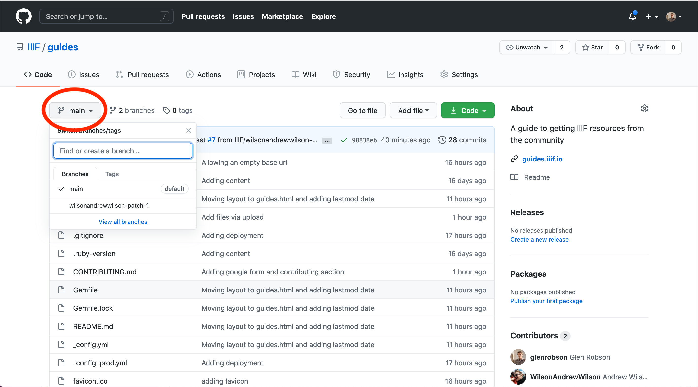

For this guide I am going to add the entry for the Yale Center for British Art, so where it says "Find or create a branch..." I am going to call my pull request `adding_yale_british_art`. I entered this text in the first red box in the screen shot below then I clicked the "Create branch: adding_yale_british_art" link which is highlighted by the second red box. 


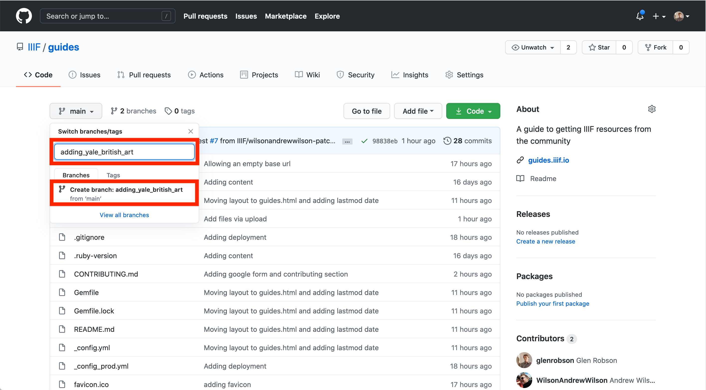

Once you click the Create branch link you should see the branch has been created with a blue information message at the top and also in the drop down you should see your new branch is selected. Both of these have been highlighted in the screen shot below.

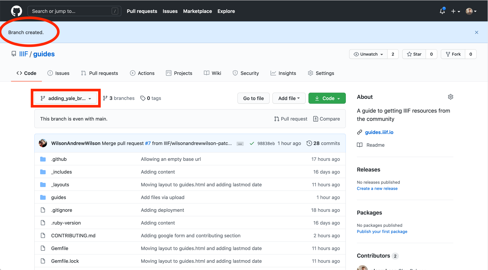

### Step 3: Create your guide

Now we have a branch to work on we can create our guide. The first step is to create a directory for our entry. If you click on the guides directory you will see a list of guides that already exist and also a template.md file. We are going to copy the template.md to be our index file for our new Guide. If you click on the template.md file you will see the file displayed in GitHub but not the source file we need. Click the RAW button highlighted in Red below. 

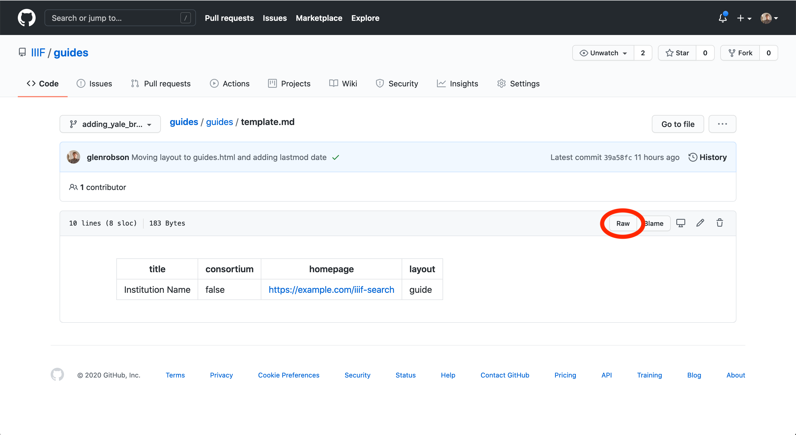

When you click the link you will see the source of the MD file and it should look similar to the screen shot below. Copy all of the text in this file as we will use this to start off our guide.

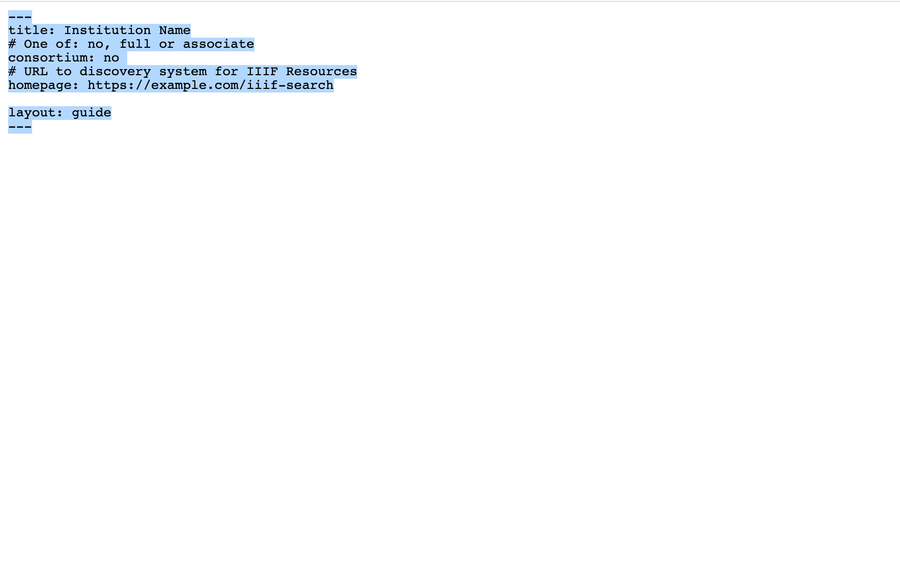

Now we have the template copied we need to go back to the list of guides (I had to click the browser back button twice). From here we are going to create our `index.md` which is the front page to our guide. GitHub has a funny way of dealing with directories and the only way to create them is if a file exists in that directory. So when we create this file in a new directory GitHub will also create it for us. To create the `index.md` file click the `Add File` button and then "Create New File".  

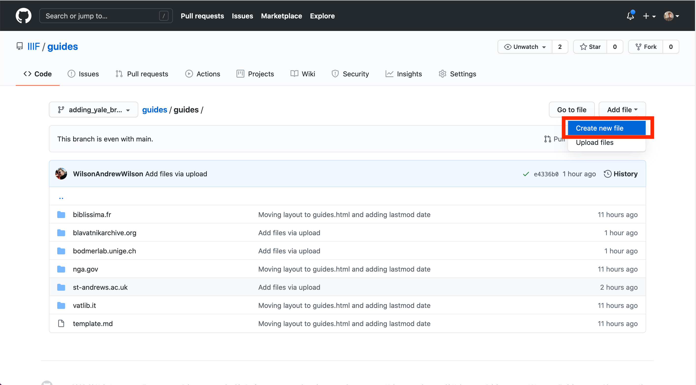

This will create an empty file and we will paste in the information we copied from the template so it looks like the following:

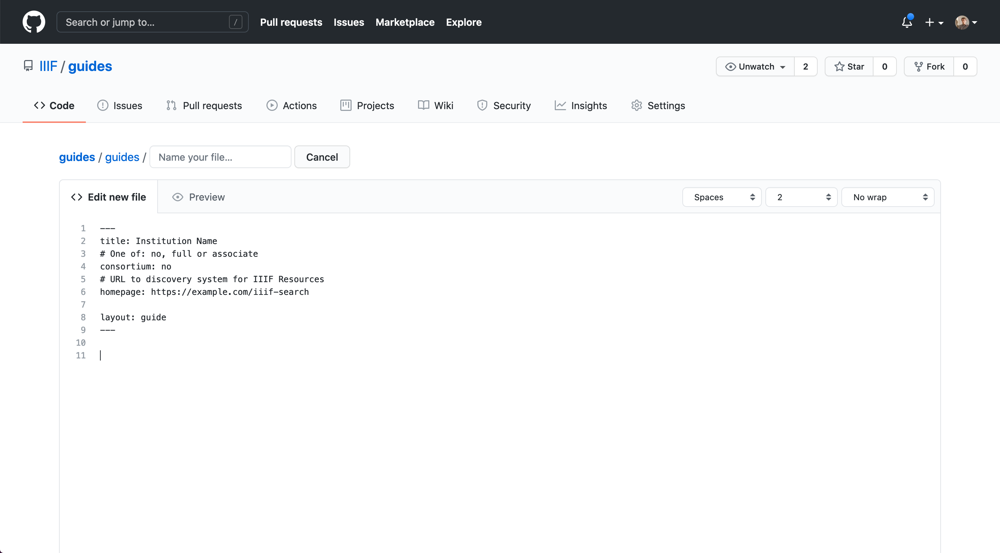

Now we need to add the filename and ensure we have the correct directory added. The directory will be named after the domain name of the site you are adding. So in this example the site is:

[https://collections.britishart.yale.edu/](https://collections.britishart.yale.edu/)

so I am going to put the guide in a directory called `collections.britishart.yale.edu`. To create the directory type it into the "Name your file" text box then add a `/` character at the end. 

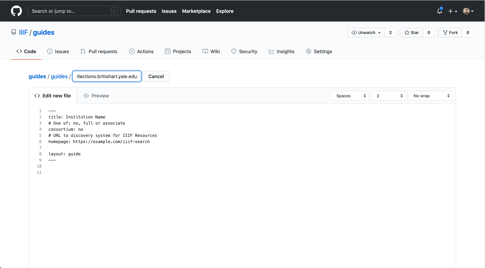

As soon as you add the `/` character it will create the directory for you. 

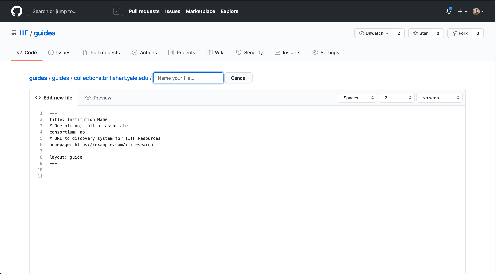

Now add the name of your file which should be `index.md`.

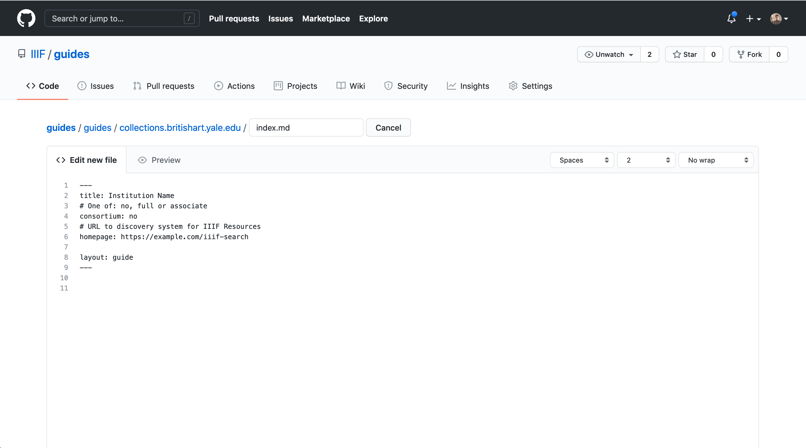

Now we have a basic file we are going to add it to the repository and come back and edit it later. If you scroll down to the bottom of the page you will see a box called "Commit new file". Here you can optionally add a note to explain the change your making. This might be useful if you are making a correction and any notes you add here will be seen by the reviewers. Also check that the option button is selected to "Commit directly to the your_branch_name" rather than creating a new branch. Once your happy with your comments click 'Commit new file.'

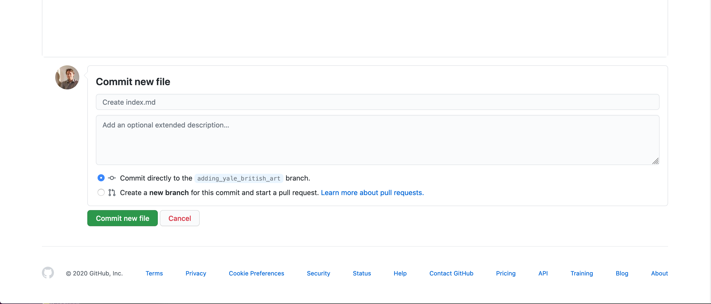
