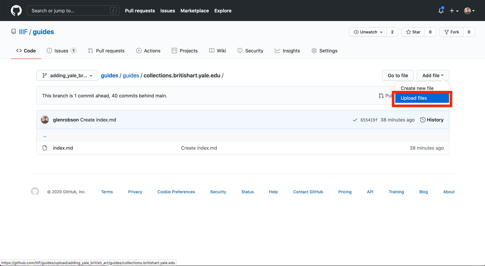
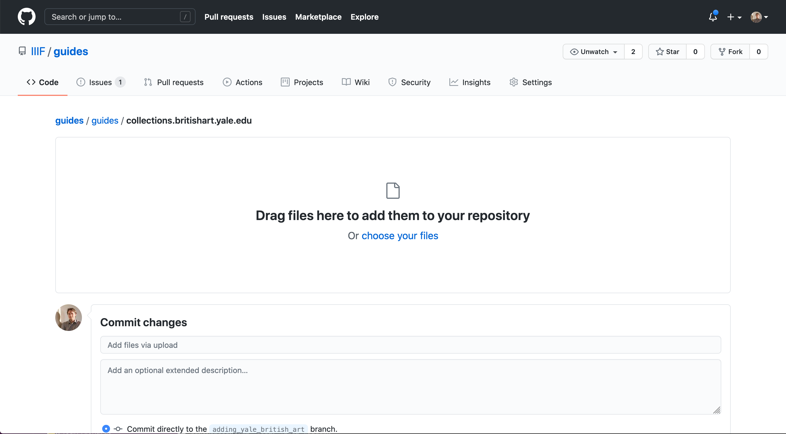
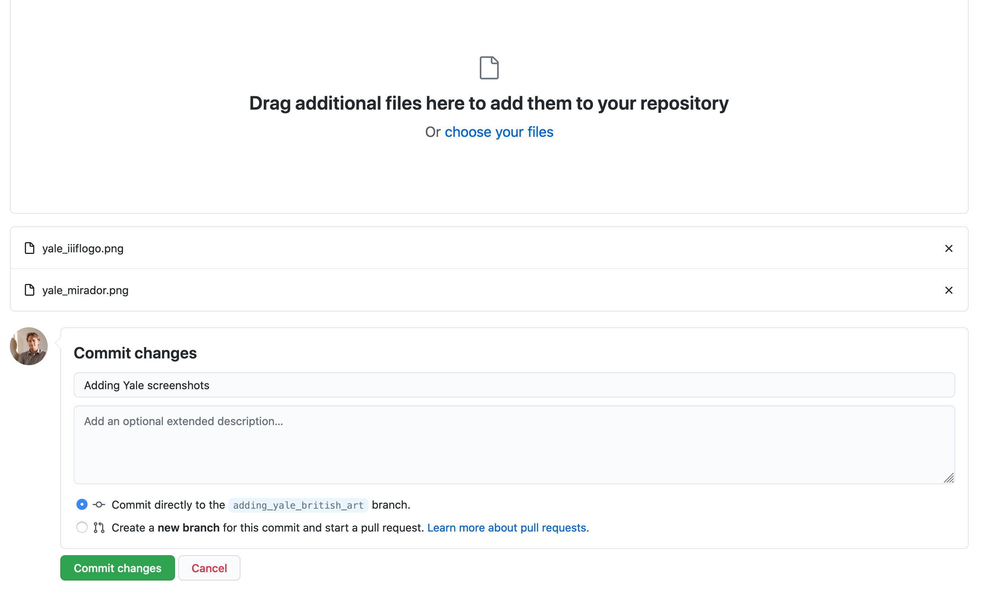
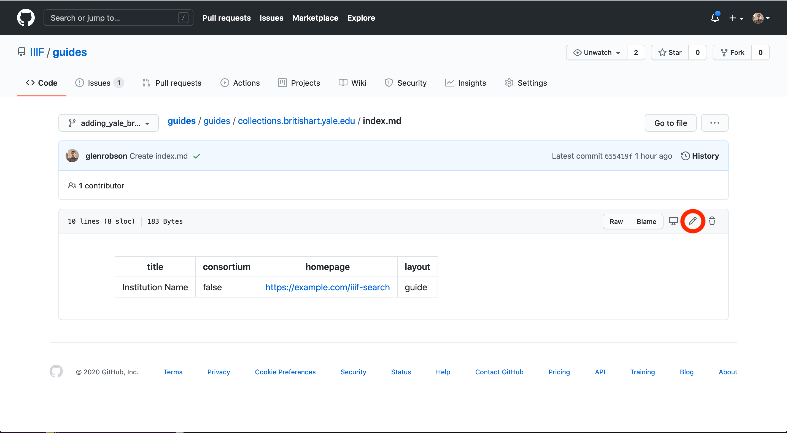
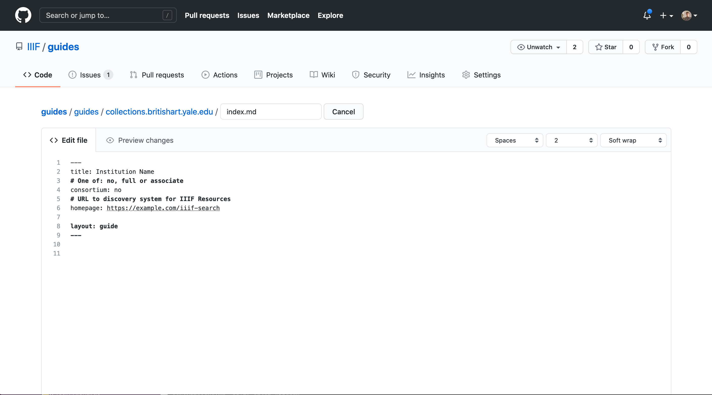
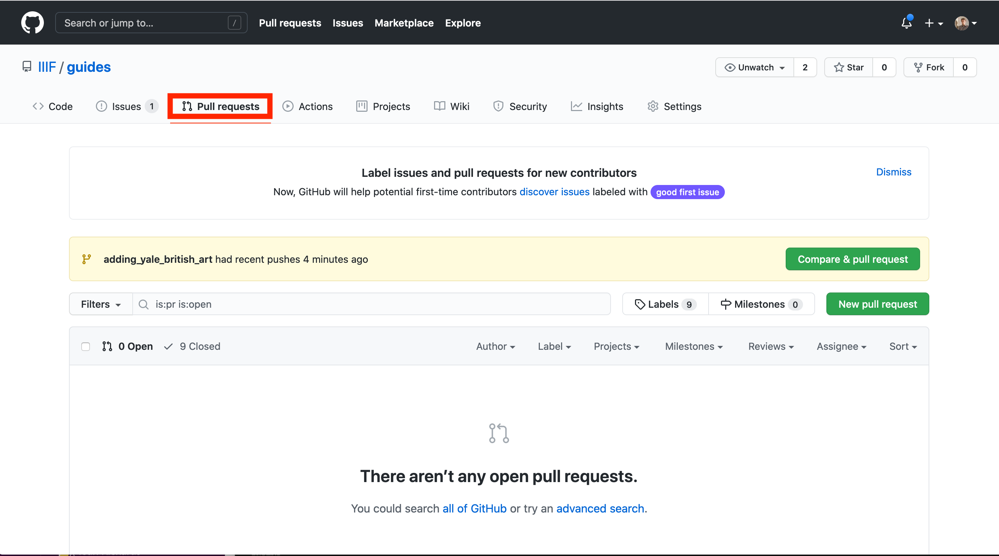
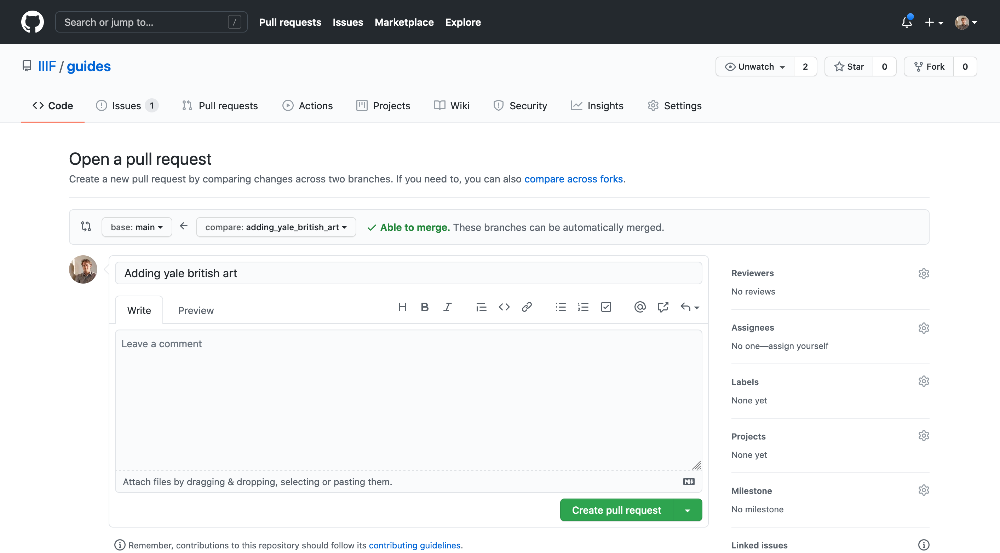
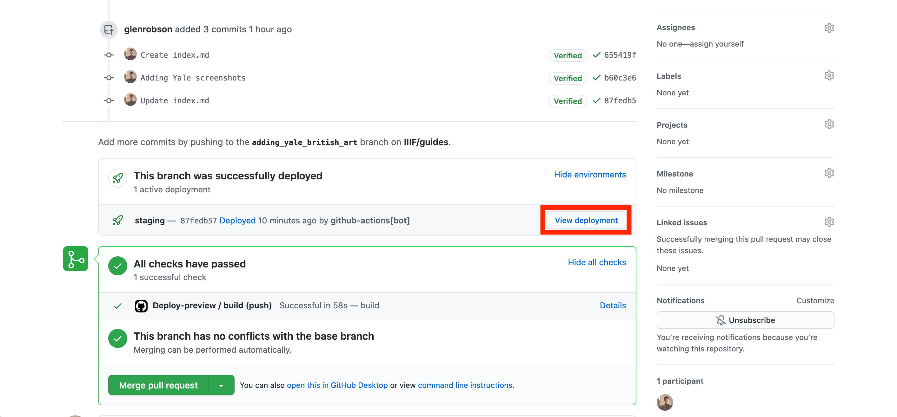
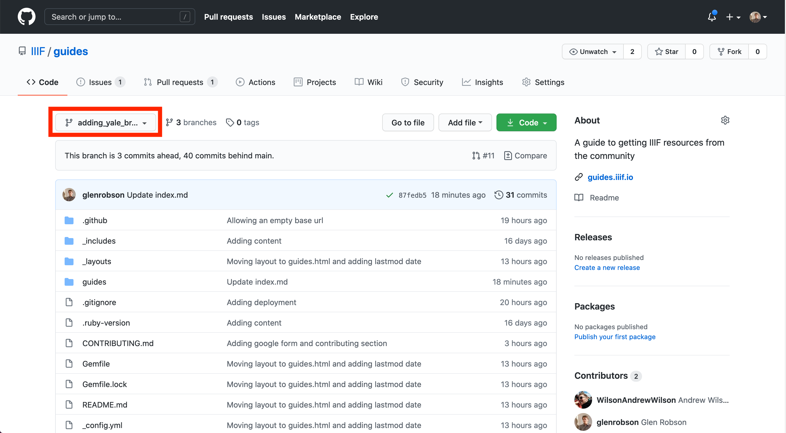

<a href="index.html">Back to Index</a><br/><br/>
We welcome pull requests to the IIIF Guides repository but please read the following guidance. 

## Summary
All pull requests submitted to this repo will need to be checked using the IIIF preview infrastructure which is generated for pull requests. This means the branch you are working on will need to be in the IIIF repo. To allow you to create a branch in the IIIF repo you will need to be in the [guides](https://github.com/orgs/IIIF/teams/guides) GitHub Team. To do this contact one of the members of IIIF staff who can add you.

The stages to add a submission are as follows:

 1. Apply to join the [guides](https://github.com/orgs/IIIF/teams/guides) GitHub team by contacting one of the IIIF staff members
 2. Clone the Guides repository to your machine [https://github.com/IIIF/guides](https://github.com/IIIF/guides)
 3. Create a new branch for your changes from the main branch.
 4. Create a new directory for your guide. Name the directory to match the domain name of the institution e.g. st-andrews.ac.uk
 5. Copy the [template.md](https://github.com/IIIF/guides/blob/main/guides/template.md) to your new directory and call it `index.md`
 6. Upload any screen shots to your new directory
 7. Edit the `index.md` file to link the screen shots. Note this can be done in Markdown using the following:

    ```
    

    e.g:

    
    ```

 8. Add and commit your changes to your local branch
 9. Create a new pull request with your changes
 10. This will be reviewed and then merged by a member of the [Guide Admin group](https://github.com/orgs/IIIF/teams/guide-admin)

## Full instructions

The steps above can all be achieved by using the GitHub web interface without installing any extra software. There is a step by step guide below to take you through this process. It may appear extensive but once you have done it a few times you should find its an efficient process and actually quicker than downloading the code and editing using an IDE. The instructions below are for creating a new entry but can be followed if you are editing an existing entry.

### Step 1: Apply to join the [guides](https://github.com/orgs/IIIF/teams/guides) GitHub team

To get permission to add to the Guides repository you need to be in the Guides GitHub team. Please contact the [IIIF Staff](mailto:staff@iiif.io) on email or through Slack and let them know your GitHub username. If you don't have a GitHub username you can sign up for one on the main [GitHub website](https://github.com/). Once the IIIF Staff have added you to the Guides team you will receive an email invitation to join the group which you should accept by clicking on the link in the email from GitHub.

### Step 2: Create a branch 

A branch creates a copy of all the pages in the website so that you can edit them without affecting the main site. When you later submit your changes for review the branch will keep track of all of your changes so the reviewer can see what has been modified. This is something that happens automatically with GitHub so once you have created your branch you don't need to worry about it and just make the changes you need. 

To create a branch go to the [Guides Repository](https://github.com/IIIF/guides) and click the branch drop down circled in red in the screen shot below:


For this guide I am going to add the entry for the Yale Center for British Art, so where it says "Find or create a branch..." I am going to call my pull request `adding_yale_british_art`. I entered this text in the first red box in the screen shot below then I clicked the "Create branch: adding_yale_british_art" link which is highlighted by the second red box. 


Once you click the Create branch link you should see the branch has been created with a blue information message at the top and also in the drop down you should see your new branch is selected. Both of these have been highlighted in the screen shot below.


### Step 3: Create your guide

Now we have a branch to work on we can create our guide. The first step is to create a directory for our entry. If you click on the guides directory you will see a list of guides that already exist and also a template.md file. We are going to copy the template.md to be our index file for our new Guide. If you click on the template.md file you will see the file displayed in GitHub but not the source file we need. Click the RAW button highlighted in Red below. 


When you click the link you will see the source of the MD file and it should look similar to the screen shot below. Copy all of the text in this file as we will use this to start off our guide.


Now we have the template copied we need to go back to the list of guides (I had to click the browser back button twice). From here we are going to create our `index.md` which is the front page to our guide. GitHub has a funny way of dealing with directories and the only way to create them is if a file exists in that directory. So when we create this file in a new directory GitHub will also create it for us. To create the `index.md` file click the `Add File` button and then "Create New File".  


This will create an empty file and we will paste in the information we copied from the template so it looks like the following:


Now we need to add the filename and ensure we have the correct directory added. The directory will be named after the domain name of the site you are adding. So in this example the site is:

[https://collections.britishart.yale.edu/](https://collections.britishart.yale.edu/)

so I am going to put the guide in a directory called `collections.britishart.yale.edu`. To create the directory type it into the "Name your file" text box then add a `/` character at the end. 


As soon as you add the `/` character it will create the directory for you. 


Now add the name of your file which should be `index.md`.


Now we have a basic file we are going to add it to the repository and come back and edit it later. If you scroll down to the bottom of the page you will see a box called "Commit new file". Here you can optionally add a note to explain the change your making. This might be useful if you are making a correction and any notes you add here will be seen by the reviewers. Also check that the option button is selected to "Commit directly to the your_branch_name" rather than creating a new branch. Once your happy with your comments click 'Commit new file.'


Now you can add screen shots and update the index.md. 

#### Adding screen shots

To add a screen shot we need to upload the image to the directory we are working on. Click on the add file dropdown but this time select Upload files:



This will take you to a screen where you can either drag and drop your files or choose your files using a file browser. 



Once you have added all of your screen shots scroll down to the bottom where you will see the "Commit changes" box. Add a message explaining what you are adding then click "Commit changes". You will then be taken to a screen where it says it is processing your files before being forwarded on to the front page of the guides repository. Navigate back to the directory which you created so that we can now edit the index.md to add links to these screen shots. 



#### Editing your index.md or Guide description

From your Guide directory click on the index.md file and then click the pencil icon highlighted in red below to start editing the file.



Now edit your index.md. The first few lines surrounded by the `---` symbol is known as the Front Matter and are where you store variables which the site uses to generate titles and links. To edit a value change the text after the `:` symbol. Note the added text should not contain a `:` symbol. 



Start with editing the front matter where the fields are as follows:

 * __title__: this is the name of the institution. It will appear as the title of the page and also the list of institutions on the front page.
 * __consortium__: either `full`, `associate` or `no`. You can check if a institution is a consortium member on the IIIF Website [Consortium Page](https://iiif.io/community/consortium/)
 * __homepage__: this is the URL to either a specific link into the institution's catalogue to find IIIF resources or the front page of the institutions catalogue.
 * __layout__: leave this as `guide`. This controls the look of the page.

Now we have the front matter sorted we can move on to adding screen shots. Make sure that when you add the next bit you add it on a new line after the last `---`. To add a link to an image using Markdown you use the following form:

```

```

Where the text inside the `[]` is used as the alt text for the image and the text inside the `()` is the path to the image. Ensure you don't forget the `!` at the start otherwise it will appear as a link rather than an embedded image. You can also add any Markdown into your file and see this [Markdown Cheatsheet](https://github.com/adam-p/markdown-here/wiki/Markdown-Cheatsheet) for a list of options.

A complete example for the Yale Center for British Art is below:

```
---
title: Yale Center for British Art
# One of: no, full or associate
consortium: full 
# URL to discovery system for IIIF Resources
homepage: https://collections.britishart.yale.edu/
layout: guide
---


```

Once you are happy with your changes you can scroll down to the Commit Changes part and optionally add a description of your change and click "Commit changes".

When you are happy with your guide and would like to submit it for review you can create a pull request. 

### Step 4: Submit your changes for review (create pull request)

Now we have a branch with all of your changes we want to package it up and submit it as a change request to the main site. With GitHub this process is called submitting a Pull Request. If you click on the Pull Request tab at the top of the page you will be taken to the pull request screen. 



GitHub is clever enough to work out which branch you have been working from and may well show you a yellow box with a button called "Compare & pull request" and mention the branch you have been working from. If it does show this box click the "Compare & pull request" button. If it doesn't show this box then you can manually create the pull request by clicking the "New pull request" button that will take you to the same screen below. If you do have to do it manually ensure the compare branch is the one you've made changes to. 

On the create pull request screen you will see a label and description. The label will come from one of your previous commits. Use the description if you want to ask any questions or flag anything for the reviewers. Once your happy with your comments and label click "Create pull request".



You will then be taken to your Pull request screen. There are a number of useful features on this page. When you first go to the page you may see the checks as Yellow as there is a continuous integration process that is run on all pull requests to create a preview version of the website. If you see that the build is failed this is likely due to an issue with your index.md file and specifically with the front matter part. Feel free to reach out to the IIIF staff if you get a red build error. 

Once the build process has gone to green it will create a deployment which is a test version of your site. In the screen shot below I have expended the "Show environments" link and it list a single deployment. If you click the View deployment button you will be taken to a test website for you to review. 



Use this test version to check your entry has appeared in the list and when you click on the link your page looks as you expect. If you need to make changes you can click on the code link next to the Pull requests which will take you back to the front page of the repository. Select your branch in the drop down and then you can make further changes to your files. Any commits you make to your branch will update the pull request so there is not need to create another one. Ensure that any edits you make are on your branch by looking at the drop down highlighted below:



Once you are happy with your guide add a comment to your pull request to say it is ready for review. The reviewers will get an email when the pull request is created. Once a reviewer has gone over your pull request they will merge it to the main branch and it will be live on the website. They will also delete your branch so as the list of branches don't get too cluttered. Note its always possible to restore a deleted branch. 

Thank you for submitting additions to the IIIF Guides Website.


