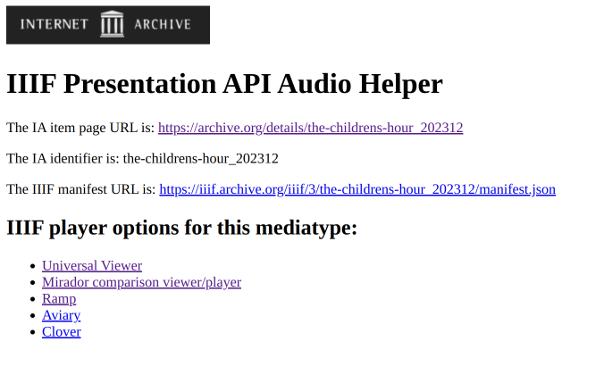
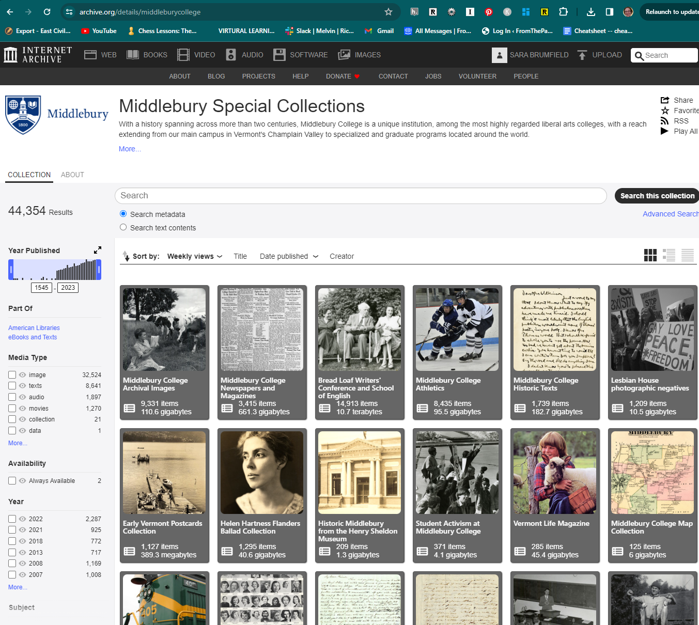
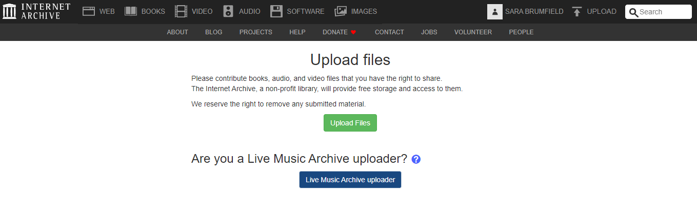
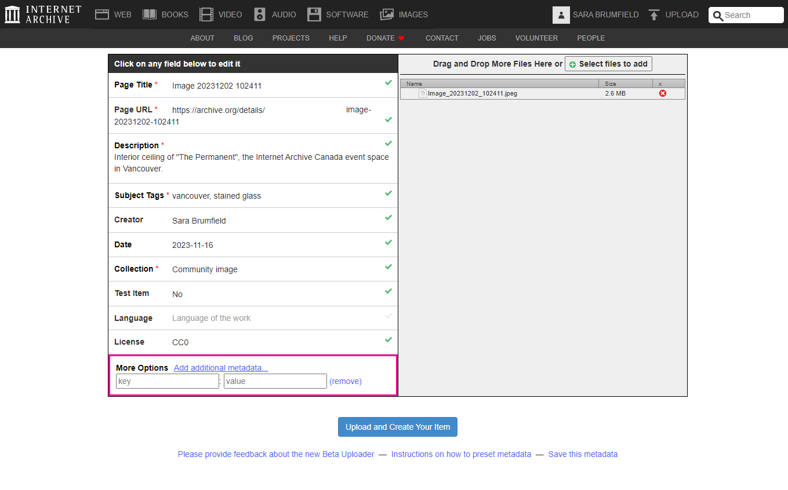
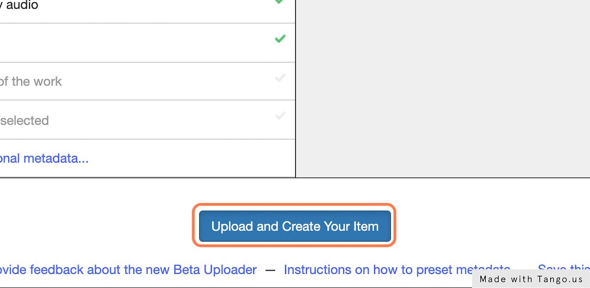
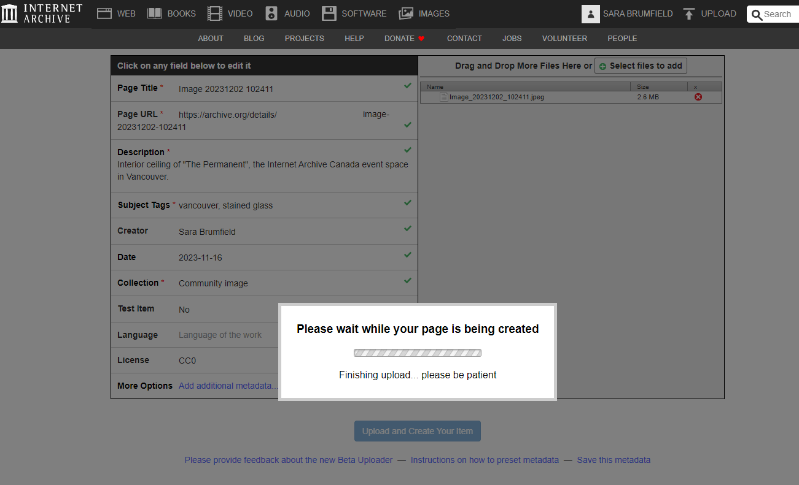
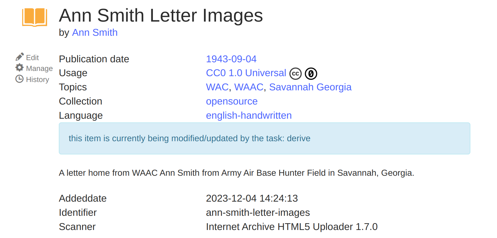

# Introduction
This guide covers both using IIIF to interact with Internet Archive items and using the Internet Archive as a IIIF enabled digital asset management system for your own items.

## IIIF for existing Internet Archive Items

### Finding the IIIF manifest for an item
1. Search for the item and visit the record page, i.e. https://archive.org/details/b29000427_0001/page/n13/mode/2up.
2. Copy the identifier for record. It's always right after "details".  In the above example it's `b29000427_0001`
3. Place that identifier into the following URL structure: https://iiif.archive.org/iiif/:id/manifest.json.  
Our example becomes: https://iiif.archive.org/iiif/b29000427_0001/manifest.json

### Using the IIIF Helpers on Internet Archive

There are also IIIF helper tools available on the Internet Archive that make it much easier to work with different types of items from the Internet Archive.
The URL structure for the helper tool looks like:

https://iiif.archive.org/iiif/helper/:id/  
Our example becomes https://iiif.archive.org/iiif/helper/b29000427_0001

Replace the :id with the identifier for the record.

IIIF helpers are available for images, books, and A/V items.

## Creating IIIF Items in the Internet Archive

You can upload material to the Internet Archive and organize it there to create a free, IIIF compatible digital asset management system like the above example from Middlebury College Special Collections.

### Item Creation Steps
**1. Sign Up For an Account** 
**2. Upload Items** 
Upload Items by clicking the "Upload" link next to your name

**3. Provide Metadata** 

**4. Click "Upload and Create"** 

**5. Wait while the page is created and the Derivative Process to Run** 

### Special Considerations for Texts and Books
Zip files need a _images at the end
	I.e. AnnSmithLetter_images.zip

You will need to choose a language for the item so the appropriate derivative processes can be run.

https://help.archive.org/help/books-and-texts-a-basic-guide/ 

### Special Considerations for Images
Although most image formats are supported by the Internet Archive, image formats that support tiling, like JPEG2000 and Pyramidal TIFF are the best types of images for the deep zoom provided by IIIF image viewers.  In our experience PTIFFs are served most efficiently by the underlying Cantaloupe image server, however, the Internet Archive does not display images on the Internet Archive item page for uploaded PTIFFs.  The item page will display a message like "THERE IS NO PREVIEW AVAILABLE FOR THIS ITEM  This item does not appear to have any files that can be experienced on Archive.org.  Please download files in this item to interact with them on your computer." [An example.](https://archive.org/details/tx-burnet-123835-1909-125000-geo)  That may be fine if you only wish to interact with the item in a IIIF context, however, if you would like the item to be both visible in the Internet Archive and via deep zoom in IIIF you may want to choose JPEG2000 format.  (You can also upload both a PTIFF and a JPEG, but the current IIIF code will unfortunately serve the JPEG instead of the PTIFF.)

Note that you do not have to use either of these tiled image formats -- normal images will also work.

### See Also
Please see the [Internet Archive Documentation on uploading](https://help.archive.org/help/category/archive-org/uploading/) for more information.
