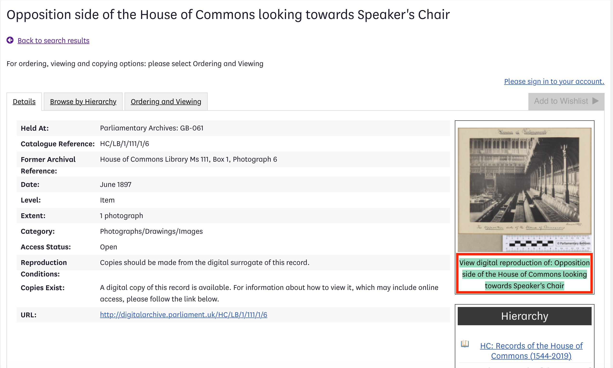
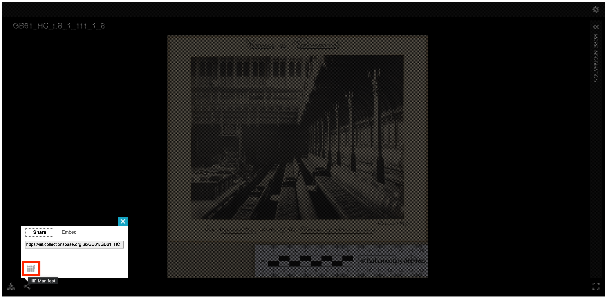

Searching through the catalogue you are able to filter results to only ones with images. Clicking through to the item on the right hand side there is an option to  'View digital reproduction of:' which shows you the images using the Universal Viewer. To view the manifest you can can click the share button.

Example item: [GB61_BAD_1](https://iiif.collectionsbase.org.uk/GB61/GB61_BAD_1/e5tD3)

