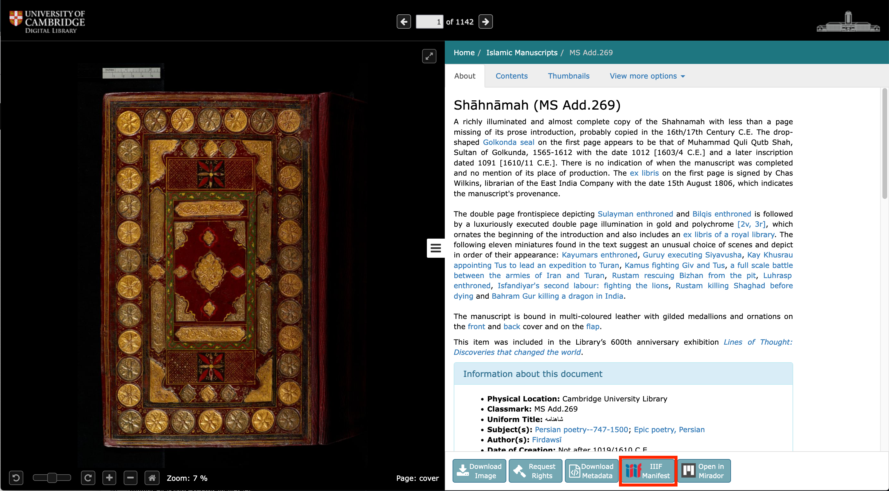

At the bottom of the right hand side panel there is a list of buttons. One is for the IIIF Manifest. Click the button to open manifest in new tab or the button can also be drag/dropped. When copying&pasting the Manifest URL, manually add the ".json" file extension before pasting into desired use location. 

