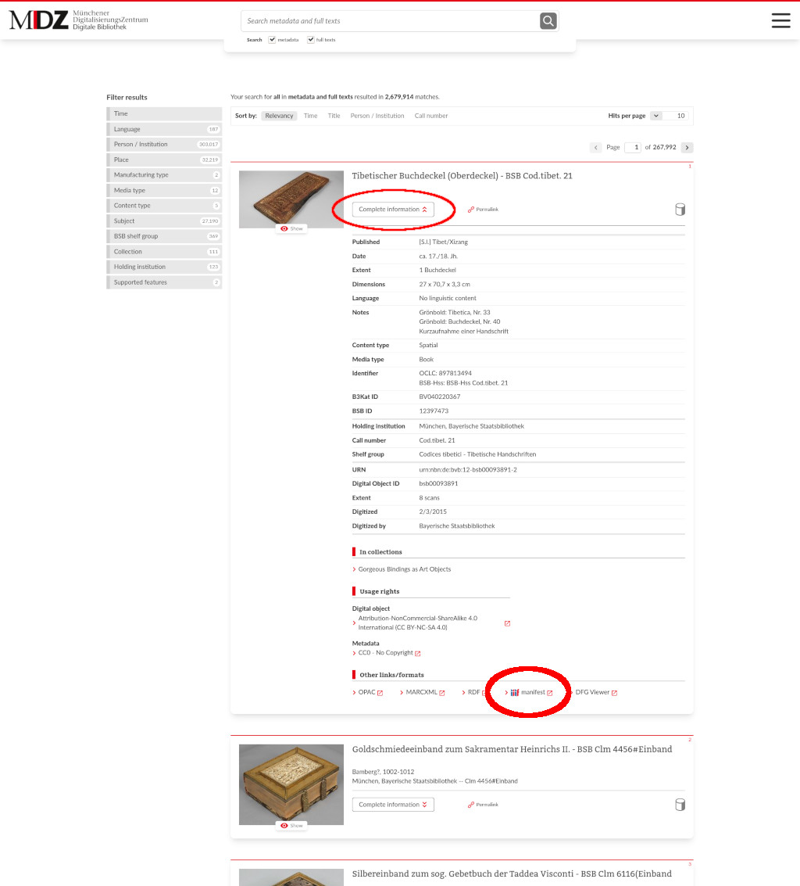
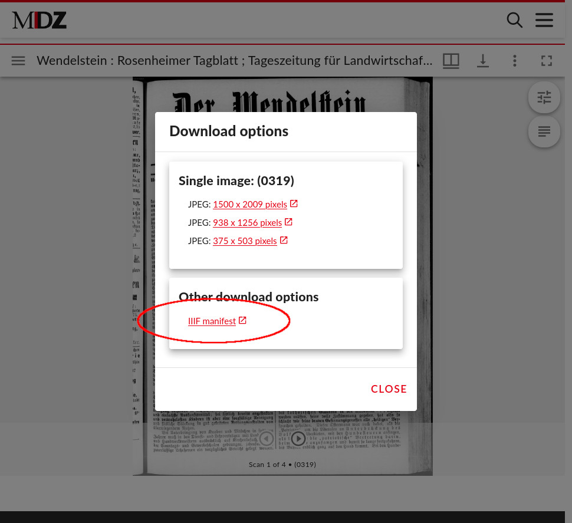
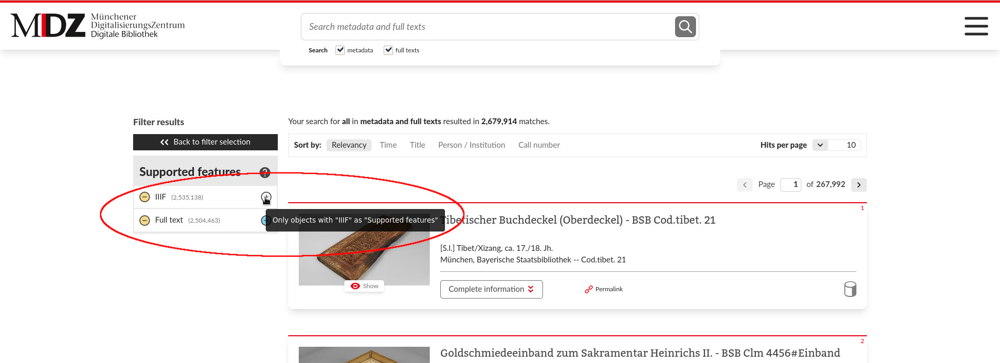

* Link to IIIF manifest in an item section of search results, after opening section "Complete information":

  

* Link to IIIF manifest in download plugin of Mirador 3: Open item in viewer and click on download icon:

  

  

* Filter IIIF items from search results:

  After issuing an empty search request, click on filter "Supported features".

  

  Select "+"-sign right of "IIIF"-filter to filter result list.

  

  The filtered list is also available under URL <https://www.digitale-sammlungen.de/en/search?filter=features%3A%22iiif%22>

* IIIF Collection of all IIIF items of BSB:

  <https://api.digitale-sammlungen.de/iiif/presentation/v2/collection/top>
