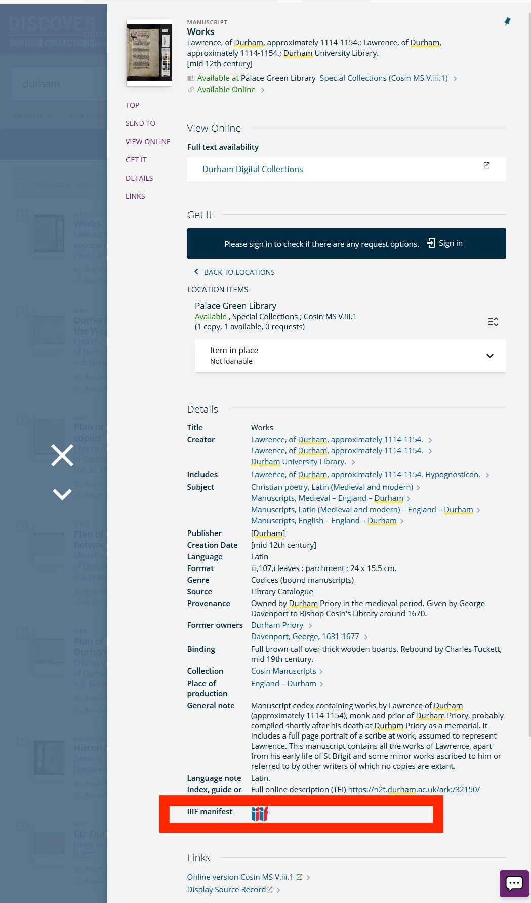

Full instructions in the Durham University [library guide](https://libguides.durham.ac.uk/asc-digitised-collections-online/iiif).

Once you find an item scroll down to the bottom of the page and you will see the IIIF icon. Right click and choose Copy Link.

