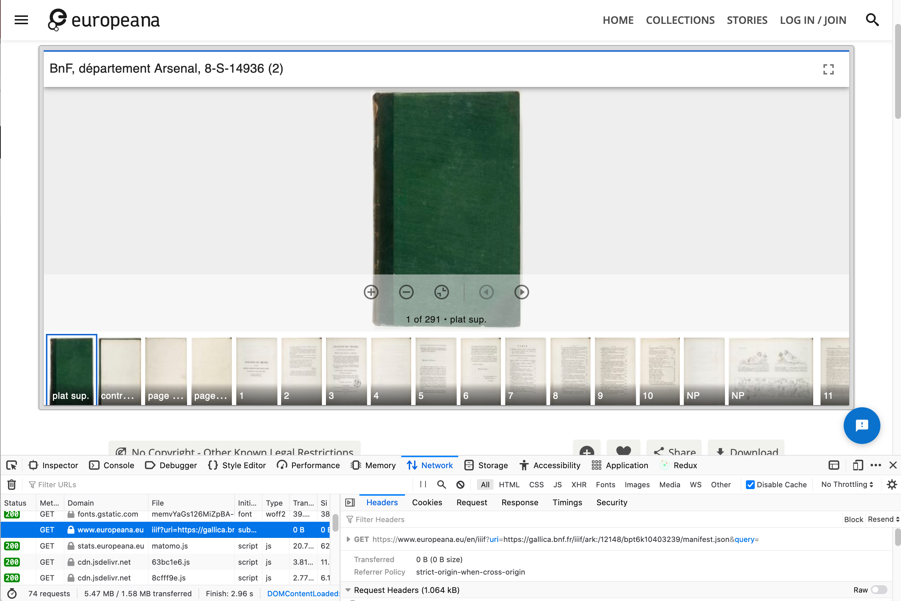

The above link takes you to all of the IIIF items in Europeana. Note some only have IIIF Images and others have Manifests.

It doesn't look like its currently possible to get the Manifest from the page but you can either go to the providing institution's page to see if the Manifest is listed or open up the Network Tab in your browser to see which Manifest is being shown. 

