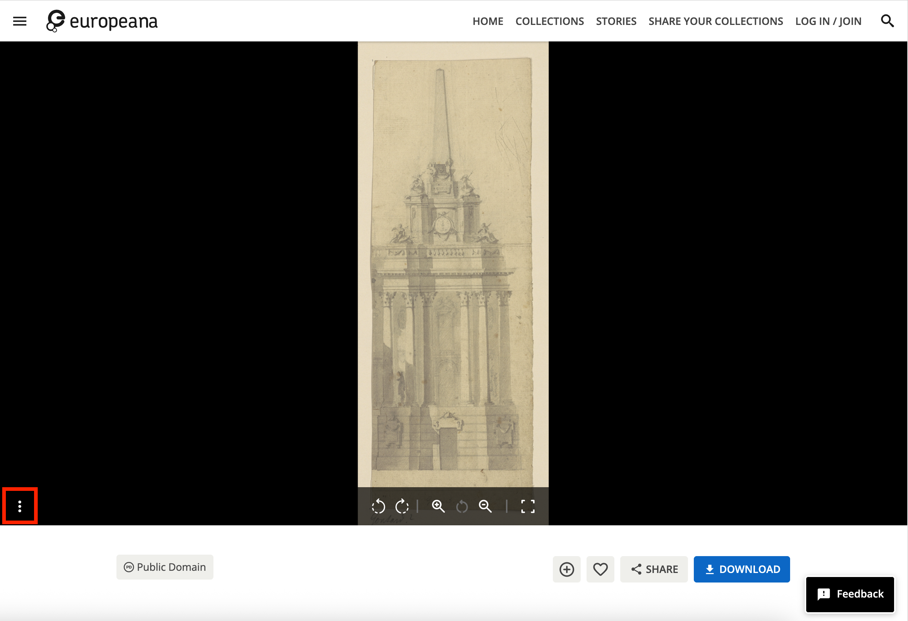
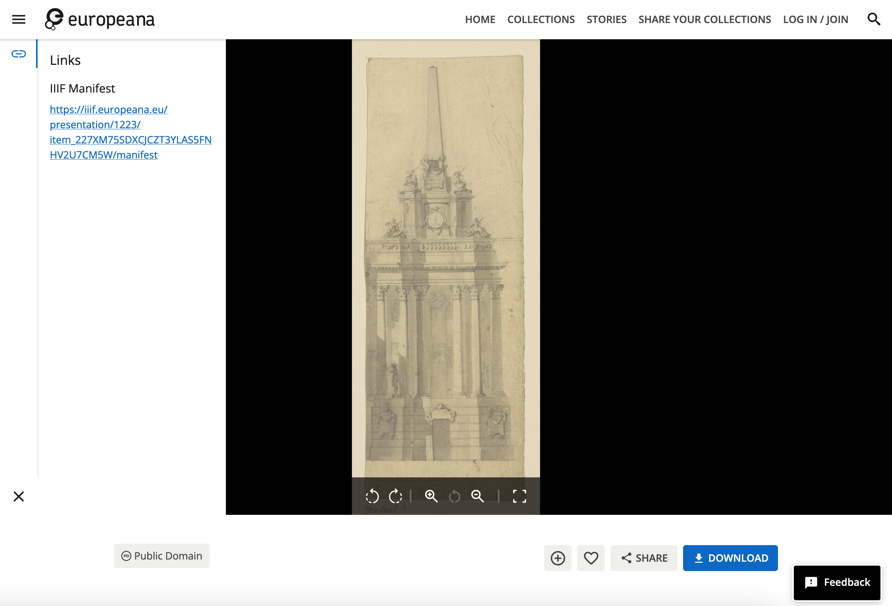

The above link takes you to all of the IIIF items in Europeana. Note some only have IIIF Images and others have Manifests.

You can now get access to a Manifest by clicking the three vertical dots highlighted in red on the left side of the image below:

Once the three dots are clicked you will see the Manifest link on the left hand side of the viewer:

