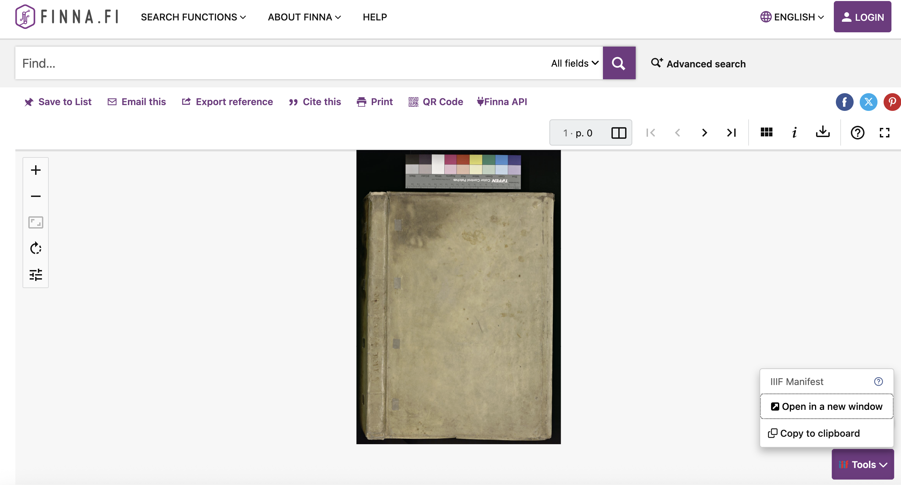

finna.fi is a Finish aggregator of cultural heritage managed by the National Library of Finland. In contains collections from Libraries, Museums and Archives across Finland. 

The link above take you to a search which filters for items with IIIF manifests. To get to this search go to the [advanced search](https://www.finna.fi/Search/Advanced) page and scroll down to the "Media type" filter and select "IIIF".

Once you have found an item that has a IIIF manifest, you can should see a IIIF icon on the botttom right with a clickable menu called IIIF Tools. Clicking open in a new window will open the Manifest in a new window and copy to clipboard will copy the Manifest URL.

