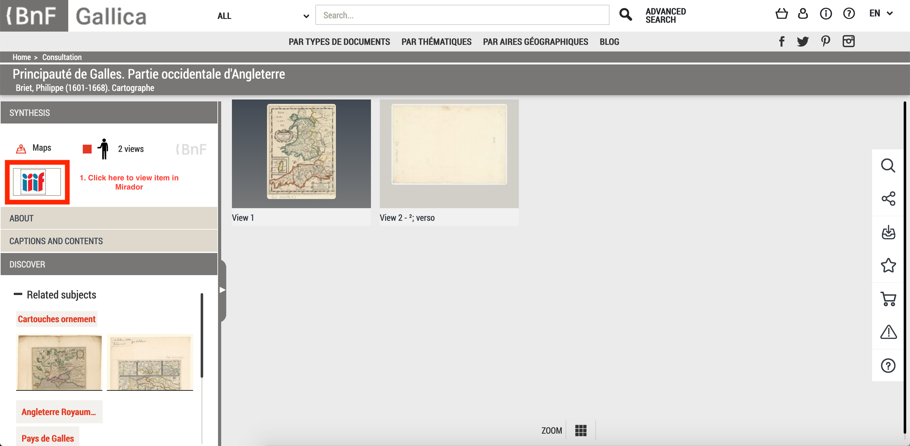

Click the IIIF icon on a item page:

This will open Mirador. Now click the `i` in the top right to open up the Manifest Information panel. Scroll to the bottom of the panel and you should see the manifest:

