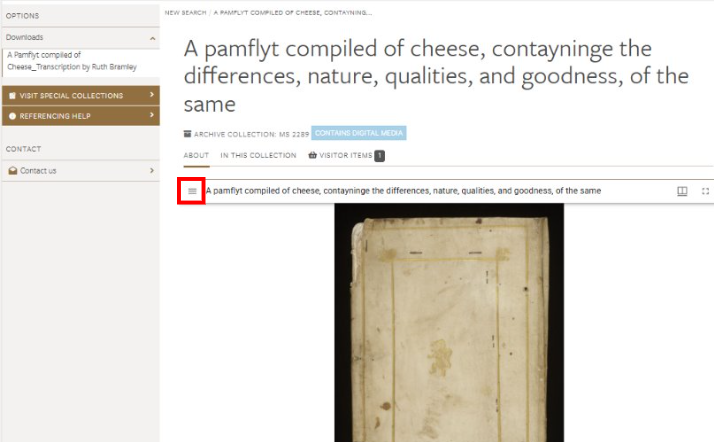
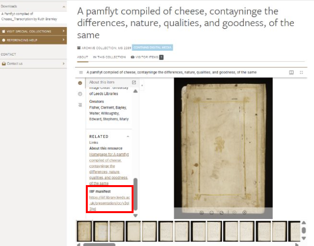
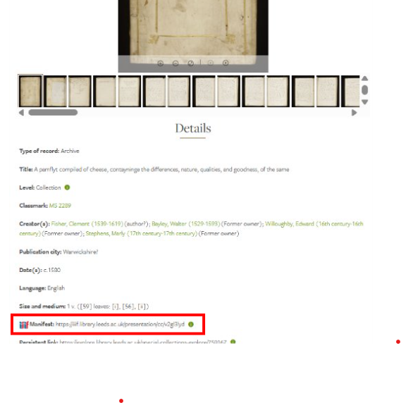
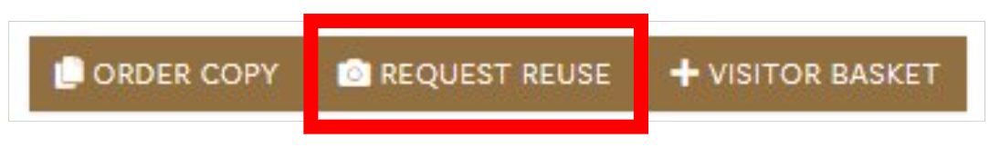

Tens of thousands of University of [Leeds Libraries’ Cultural Collections](https://library.leeds.ac.uk/info/1500/special_collections) are now IIIF enabled (and more are coming!).  For those images that have been converted to the IIIF standard, you will see a large version of the image at the top of the catalogue record.  To find the IIIF Manifest URLs, either …

1. Open the burger menu top left of the image at the top of the catalogue record

and then scroll to the bottom to see the IIIF manifest

Or...

2. Scroll down to the ‘Details’ area of the catalogue record where you’ll see the IIIF logo next to the manifest:

Please remember to check any access usage stipulations in the Access and Usage section of the catalogue record…

...and to request re-use if you plan to publish elsewhere, for example, in a digital exhibition (this is only necessary if you see the re-use button on the record). 

