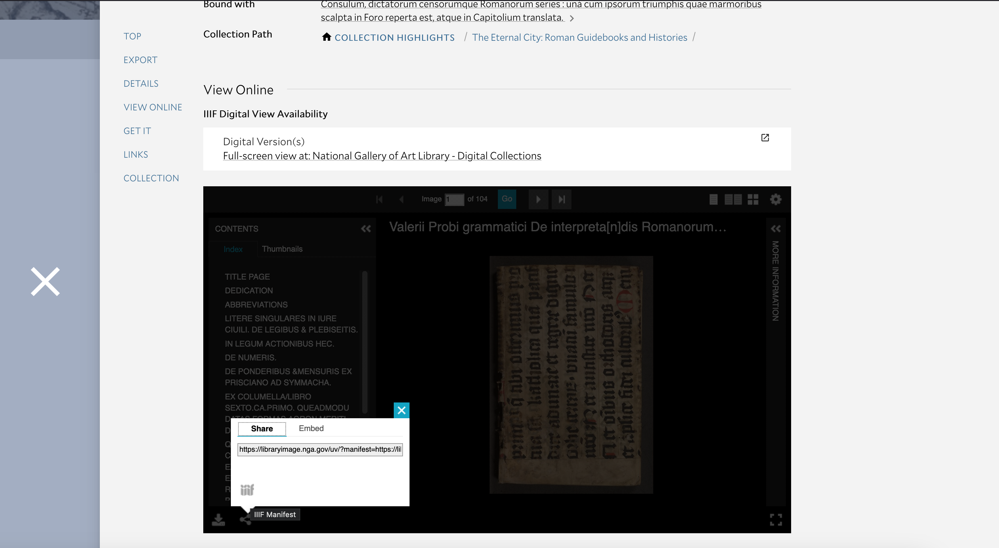

1. Browse or search titles from Digital Collections and its sub collections, such as Image Collections or Special Collections. Library Catalog main page default search also returns IIIF-enabled digital titles as well as physical and electronic records. 
2. IIIF viewer is embedded and displayed at each record level interface. Universal viewer is adopted for book titles, while mirador3 viewer displays images collection resources.
3. Direct link to IIIF resource is displayed at record level under View Online section as: Full-screen view at: National Gallery of Art Library - Digital Collections

Example record: [Grandezze della città di Roma antiche e moderne come al presente si ritrovano, di nuovo ristampato in quattro linguaggi: latino, volgare, francese...](https://libraryimage.nga.gov/uv/?manifest=https://libraryimage.nga.gov/manifest/mms/99682033504896.json#?c=0&m=0&s=0&cv=0&xywh=-2835%2C-267%2C9101%2C5333)

