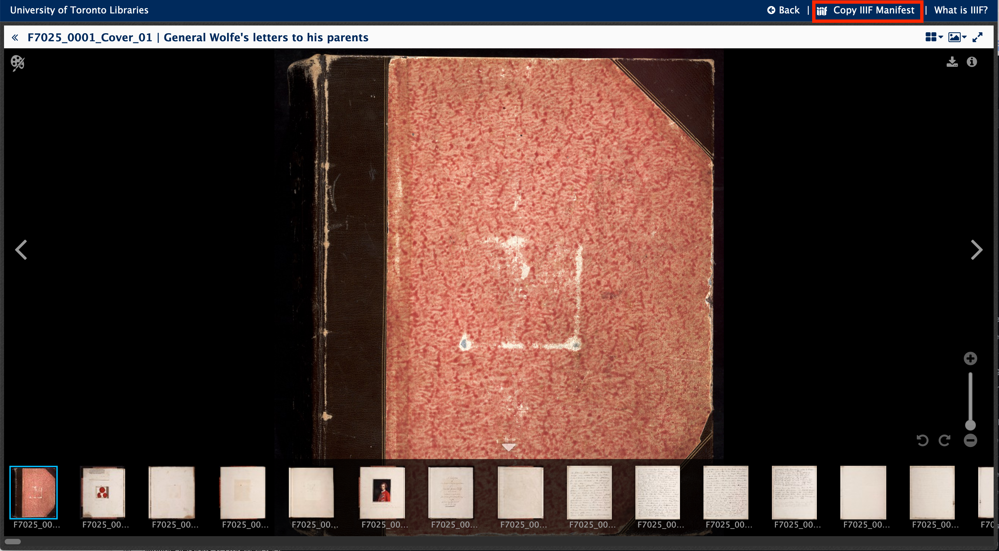

Use the "Copy Manifest" button on Collections and object pages.

Also see this dedicated page for IIIF Collections:

[https://collections.library.utoronto.ca/IIIF-collections.html](https://collections.library.utoronto.ca/IIIF-collections.html)
