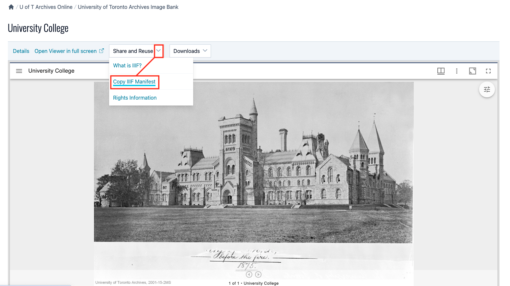

On the bottom of an object's page, click on the Share and Reuse tab and you will see the Copy IIIF manifest button for the object.

Also see this dedicated page for how to access IIIF resources, check copyright and reuse regulations, and see what you can do with IIIF:

[https://collections.library.utoronto.ca/explore/faq/getting_started](https://collections.library.utoronto.ca/explore/faq/getting_started)
