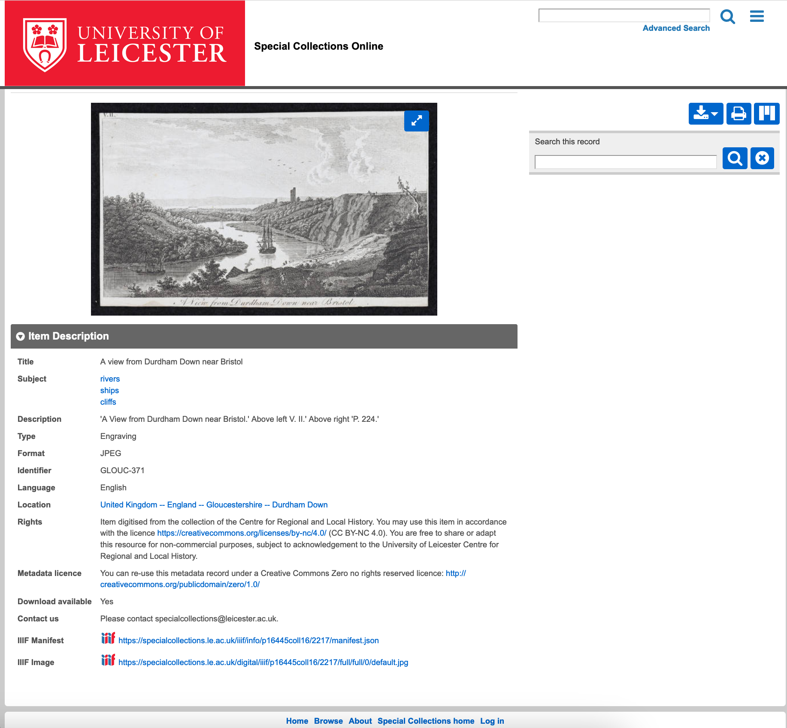

On an item page, scroll down past the media file to the section Item Description. Use the field IIIF Manifest (second from bottom). Right click on the url displayed to copy and add to Mirador etc

Example: [A view from Durdham Down near Bristol](https://specialcollections.le.ac.uk/digital/collection/p16445coll16/id/2217/rec/16)

