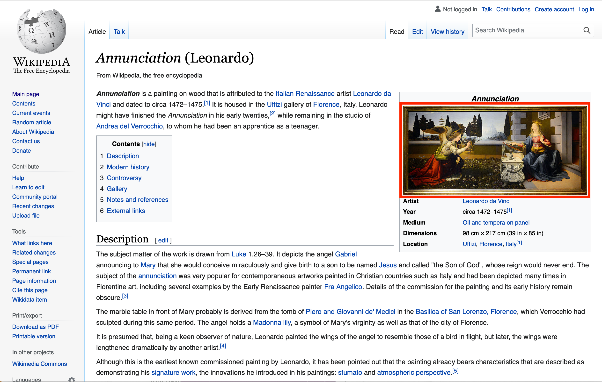

It is possible to get access to any image on Wikipedia using a hidden beta IIIF image service. To access this service you need to find the filename of the image you are interested in then feed it into the following URL:

[https://tools.wmflabs.org/zoomviewer/proxy.php?iiif=[file_name]/info.json](https://tools.wmflabs.org/zoomviewer/proxy.php?iiif=[file_name]/info.json)

In this example we are trying to find the filename for the [Annunciation](https://en.wikipedia.org/wiki/Annunciation_(Leonardo)) by Leonardo da Vinci. First click on the image in the Wikipedia page to get to the image in Wikimedia Commons. 

This will take you to a preview of the full image on Wikimedia Commons. You now need to click the "More details" button to get to the full Wikimedia Commons page.

Now look at the URL in the address bar and you will see something like the following:

[https://commons.wikimedia.org/wiki/File:Annunciation_(Leonardo).jpg](https://commons.wikimedia.org/wiki/File:Annunciation_(Leonardo).jpg)

This gives the filename you need at the end of the URL after the `File:` part. You can then take the filename to create the following URL to the info.json:

[https://tools.wmflabs.org/zoomviewer/proxy.php?iiif=Annunciation_(Leonardo).jpg/info.json](https://tools.wmflabs.org/zoomviewer/proxy.php?iiif=Annunciation_(Leonardo).jpg/info.json)

Note the URL above will forward you on to a cached version of the image.
